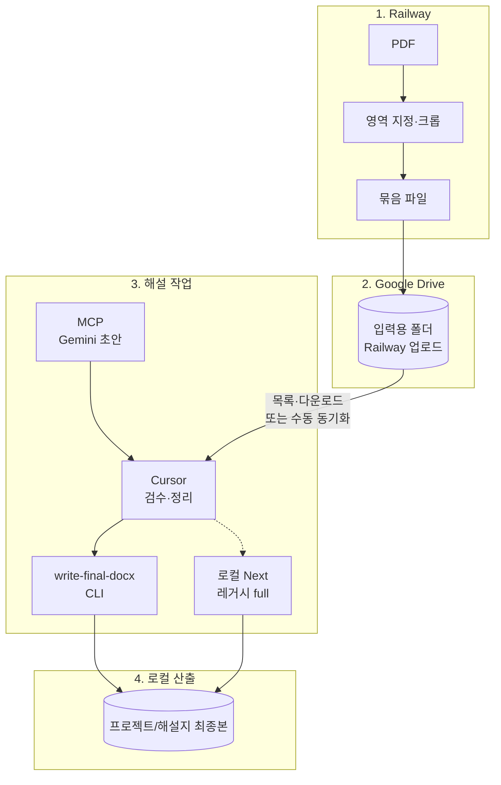

# 해설지 파이프라인 — 확정 동선

- 문서 기준일: 2026-05-02
- 작업 후 문서를 어떻게 맞출지: [POST_WORK_DOCS.md](./POST_WORK_DOCS.md)

## 문서 세트 (기록·운영)

작업을 지속할 때 **academy_manager `docs`와 같은 습관**으로 아래를 함께 갱신합니다.

| 문서 | 역할 |
|------|------|
| [enterprise_workflow.md](./enterprise_workflow.md) | Gate A~E, 작업 단위·PRD-lite, 트리아지 |
| [context.md](./context.md) | 제품 컨텍스트, **의사결정 로그 표** |
| [plan.md](./plan.md) | 목표, 원칙, 완료/다음 단계 |
| [checklist.md](./checklist.md) | PASS/FAIL·회귀·미완료 |
| [models.md](./models.md) | LLM·env 키 |
| [POST_WORK_DOCS.md](./POST_WORK_DOCS.md) | **작업 후 문서 반영 규칙**(코드 변경 시 함께 갱신할 문서) |

각 파일 상단의 **문서 기준일**을 작업일에 맞출 것.

---

## 한 줄 구조(사용자 기준)

1. **Railway / 앱** — PDF에서 영역 지정한 부분 **크롭**  
   - **`NEXT_PUBLIC_UI_MODE=crop`** 이면 UI가 **시험지 선택 + 영역 지정(+ 필요 시 Drive ZIP)** 중심이고, 해설·DOCX 단계는 숨깁니다. **해설·DOCX는 Cursor + MCP + CLI** 쪽이 주 동선입니다.  
2. **Google Drive** — 그 묶음(이미지·zip 등)을 **Drive의 지정 폴더**에 저장  
3. **Cursor + MCP** — MCP 도구로 Gemini **해설 초안** 생성 → Cursor가 **형식·검수** → **`npm run write-final-docx`** 또는 (레거시) 로컬 Next `/api/save-result` 로 **로컬 `해설지 최종본`** 에 DOCX 저장  
4. **로컬 `해설지 최종본`** — 최종 해설지(DOCX)를 **반드시 이 폴더에 저장**해 두어, 다른 PC로 폴더만 복사해도 동일하게 쓸 수 있게 함  

상세·가능 여부·MCP 설정: **[CURSOR_MCP_WORKFLOW.md](./CURSOR_MCP_WORKFLOW.md)**  

---

## 다이어그램



---

## 폴더 이름 정리 (헷갈림 방지)

| 위치 | 역할 | 비고 |
|------|------|------|
| **Drive · 입력 폴더** | 시험지 PDF 등 **읽기** | **`GOOGLE_DRIVE_EXAMS_FOLDER_ID`** (또는 부모 아래 `시험지`) |
| **Drive · 작업완료** | 크롭 문항을 **ZIP 한 개**로 업로드 | **`GOOGLE_DRIVE_WORK_COMPLETE_FOLDER_ID`** 또는 부모 아래 **`작업완료`**. API: **`POST /api/upload-crop-bundle`** |
| **로컬(서버 디스크) · `크롭된 시험지`** | 크롭 ZIP을 **프로젝트 루트 기준** 폴더에 저장 (`npm run dev` 시 PC 프로젝트에 생성) | API: **`POST /api/save-crop-bundle-zip`**. 상수: `CROPPED_EXAMS_DIR_NAME`. 원격 배포 시에는 컨테이너 내부 경로임 |
| **로컬 · `해설지 최종본`** | **최종 해설 DOCX만** 저장 | **`npm run write-final-docx`** 또는 API `/api/save-result`(동일 빌더). 상수: `FINAL_EXPLANATION_DIR_NAME` |

**원칙:** 최종 **DOCX**는 Drive API로 올리지 않음. **크롭 ZIP**은 **로컬 `크롭된 시험지`** 저장, **브라우저 다운로드**, 또는 Drive **`작업완료`** 중 선택(UI).

---

## 폴더 일괄 → 해설 DOCX (자동화 1단계)

한 폴더 안에 **이미 작성된** 해설 본문(`.md` / `.txt`)이 여러 개 있을 때, **한 번에** `해설지 최종본`에 DOCX를 만든다. (**Gemini 호출 없음** — MCP·앱·Cursor로 본문을 만든 뒤 파일로 저장해 두고 실행.)

```bash
npm run batch:from-dir -- --input ./입력해설
npm run batch:from-dir -- --input ./입력해설 --recursive
npm run batch:from-dir -- --input ./입력해설 --dry-run
```

- **파일명(확장자 제외)** → 시험지 이름(`examName`).
- 각 파일은 **맨 앞이 `[문제]` 또는 `[정답]`**으로 시작하고, **`[해설]`** 본문이 충분히 있어야 한다(일반 문서는 자동 건너뜀).
- 스크립트: `scripts/batch-explanations-from-dir.mts`.

**크롭 이미지 폴더 → 해설 DOCX(자동화 2단계):** `npm run dev`로 로컬 Next를 띄운 뒤, 크롭이 모인 폴더를 지정하면 이미지마다 `POST /api/generate-explanation`을 호출하고 `해설지 최종본`에 DOCX를 만든다.

```bash
npm run batch:crops-to-docx
npm run batch:crops-to-docx -- --input ./크롭된 시험지
npm run batch:crops-to-docx -- --base-url http://127.0.0.1:3000 --dry-run
npm run batch:crops-to-docx -- --delay-ms 1200 --generation-mode final --solver-profile balanced
```

- 기본 `--input`은 프로젝트 루트의 **`크롭된 시험지`**(없으면 오류). `.png` / `.jpg` / `.jpeg` / `.webp` 만 대상(`.zip` 등은 건너뜀 — 압축은 먼저 풀기).
- **비용·429**: `--delay-ms`(기본 800)로 요청 간격을 늘릴 것. 모델은 서버의 `.env.local`·`generate-explanation` 라우트와 동일.
- 스크립트: `scripts/batch-crops-to-docx.mts`.

---

## 타 컴퓨터에서 동일하게 쓰기 (이기성)

1. 프로젝트 폴더 `highroad-math-solution` 전체 복사  
2. (선택) 로컬 **`시험지`**, **`크롭된 시험지`**, **`해설지 최종본`** 폴더도 같이 복사 — 오프라인·동일 스냅샷  
3. 새 PC에서 `.env.local` 다시 작성(API 키·Drive OAuth·폴더 ID). **Drive를 쓰지 않으면** 묶음만 `시험지`에 넣고 앱만 실행해도 됨  
4. `npm install` → `npm run dev`  

앱은 경로를 **`process.cwd()` 기준 상대 경로**(`시험지`, `크롭된 시험지`, `해설지 최종본`)로 쓰므로, **같은 구조로 내려받으면** 동작이 동일합니다.

---

## 전문가 토의에서 유지한 판단(요약)

- 크롭 단위가 비전 품질에 유리하고, **파싱 본체는 Railway**, **Cursor는 보조**  
- DOCX는 **2단·문제·빠른정답·해설** 형식만 맞추면 됨(픽셀 단위 동일 불필요)  
- LLM 키·모델: `docs/models.md`  

## 환경변수

- `.env.local.example` — Drive OAuth(선택), **`GOOGLE_DRIVE_EXAMS_FOLDER_ID`**(Railway 묶음 **읽기 전용**)
