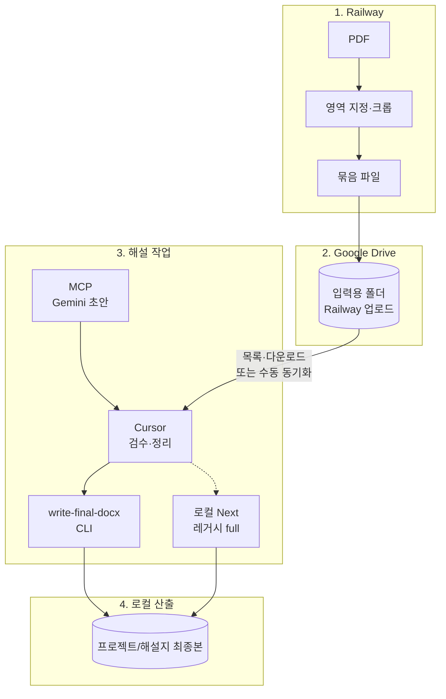

# 해설지 파이프라인 — 확정 동선

- 문서 기준일: 2026-05-02
- **해설집 품질 최우선 시:** [BEST_QUALITY_WORKFLOW.md](./BEST_QUALITY_WORKFLOW.md)를 먼저 본 뒤 이 문서의 전체 동선을 따라간다.
- **작업 전·중·후 `docs` 습관:** [POST_WORK_DOCS.md](./POST_WORK_DOCS.md) — **작업 시작 전에는 이 세트를 먼저 읽고**, 작업할 때마다 기록·작업 후 대조표까지 따른다.

## 문서 세트 (기록·운영)

작업을 지속할 때 **academy_manager `docs`와 같은 습관**으로 아래를 함께 읽고·갱신합니다.

| 문서 | 역할 |
|------|------|
| [POST_WORK_DOCS.md](./POST_WORK_DOCS.md) | **작업 전 선행 읽기 목록**, 작업 중 기록, **작업 후 반영 규칙**(코드 변경 시 함께 갱신할 문서) — **가장 먼저 볼 문서 중 하나** |
| [enterprise_workflow.md](./enterprise_workflow.md) | Gate A~E, 작업 단위·PRD-lite, 트리아지 |
| [context.md](./context.md) | 제품 컨텍스트, **의사결정 로그 표** |
| [plan.md](./plan.md) | 목표, 원칙, 완료/다음 단계 |
| [checklist.md](./checklist.md) | PASS/FAIL·회귀·미완료 |
| [models.md](./models.md) | LLM·env 키 |
| [AGENTIC_MD_PIPELINE.md](./AGENTIC_MD_PIPELINE.md) | matplotlib·OpenAI preflight·`validate:format` Agentic 동선 |

각 파일 상단의 **문서 기준일**을 작업일에 맞출 것.

---

## 한 줄 구조(사용자 기준)

1. **Railway / 앱** — PDF에서 영역 지정한 부분 **크롭**  
   - **`NEXT_PUBLIC_UI_MODE=crop`** 이면 UI가 **시험지 선택 + 영역 지정(+ 필요 시 Drive ZIP)** 중심이고, 해설·DOCX 단계는 숨깁니다. **해설·DOCX는 Cursor + MCP + CLI** 쪽이 주 동선입니다.  
2. **Google Drive** — 그 묶음(이미지·zip 등)을 **Drive의 지정 폴더**에 저장  
3. **Cursor + MCP** — MCP로 **해설 초안** → Cursor가 **중재**(품질 중심) → **`npm run write-final-docx`** 또는 `/api/save-result` 로 **`해설지 최종본`** DOCX 저장. **틀**은 대략 맞추면 되고, **해설 본문**을 좋게 만드는 데 시간을 쓴다([CURSOR_MCP_WORKFLOW.md](./CURSOR_MCP_WORKFLOW.md)「원장님 확정 운영 원칙」).  
4. **로컬 `해설지 최종본`** — 최종 해설지(DOCX)를 **반드시 이 폴더에 저장**해 두어, 다른 PC로 폴더만 복사해도 동일하게 쓸 수 있게 함  

상세·가능 여부·MCP 설정: **[CURSOR_MCP_WORKFLOW.md](./CURSOR_MCP_WORKFLOW.md)**  

### 손이 최소로 가는 동선(원장님 기준, 전문가 토의 합의)

**원하시는 그림** — `크롭된 시험지`에 문항 이미지(또는 zip)만 넣고, **규칙(`[정답]`·`[해설]` 등)에 맞는 해설**을 모아 **해설지 최종본**에 한 번에 넣는다.

- **가장 손이 적은 자동 경로(배치):** `npm run dev` 후 `npm run batch:crops-to-docx` → API만 연속 호출해 **합본 DOCX**까지(**MCP·Cursor 중재 없음**). 품질 우선이면 **`npm run batch:crops-drafts`** (`--drafts-only`) 로 **`해설 작업중/`** 에 초안만 두고, **Cursor·MCP 중재 후** `write-final-docx` ([CURSOR_MCP_WORKFLOW.md](./CURSOR_MCP_WORKFLOW.md)).
- **Cursor + MCP 경로:** 채팅에서 MCP로 **초안만** 뽑거나, 빠진 문항만 보정할 때 쓴다([CURSOR_MCP_WORKFLOW.md](./CURSOR_MCP_WORKFLOW.md)). 완전 무인이 아니라 **대화로 조정**하는 쪽에 가깝다.
- **여전히 한 번은 보는 것이 안전:** 자동이라도 난이도 높은 문항은 화면에서만 확인하거나, 해당 문항만 Cursor에서 다시 다듬는 정도가 현실적인 **최소 손**.

### Gemini 1차 → OpenAI 2차 검증 → **중재** → 해설지 최종본 (원장님 확정 동선)

**의도:** 문제 풀이는 **제미나이(비전) 위주**로 두고, **킬러·불안한 구간은 오픈AI로 2차 체크**할 수 있게 한다. 다만 **두 모델이 내놓는 문장이 항상 같거나 한 번에 끝나는 것은 아니다.** 그 사이·그 이후에 **원장님 + Cursor가 계속 중재**한다 — 정답이 엇갈리면 이미지·보기를 다시 기준으로 잡고, 형식(`[정답]`/`[해설]`)을 하나로 맞추고, 최종 한 세트만 남긴다.

| 단계 | 무엇을 쓰는지 | 비고 |
|------|----------------|------|
| **1차** | **Gemini** (`GEMINI_MODELS_GENERATE_*`, 프로필에 따라 easy/balanced/killer) | 크롭 이미지 기준 본 풀이·초안 |
| **2차** | **OpenAI**(선택) — 교차 검증·대안 풀이 | `EXPLANATION_CROSS_VERIFY=true`, `OPENAI_API_KEY`. **프로필별 모델**(easy→기본 mini, balanced/killer→기본 4o 등)은 [models.md](./models.md) 「하이브리드 라우팅」. |
| **중재(계속)** | **Cursor**(에이전트·채팅) + **원장님 판단** | 제미나이 초안 vs 오픈AI 수정안이 **다르면** 어느 쪽을 따를지·어디를 합칠지 정한다. 한 문항에 대해 **여러 번** MCP/앱을 왕복해도 된다. 목표는 **규칙에 맞는 해설 한 벌**만 남기는 것. |
| **합본·저장** | 위에서 확정한 텍스트를 `[문항 n]` … 형식으로 묶어 **`npm run write-final-docx`** 또는 **`/api/save-result`** 로 **`해설지 최종본`** | 자동 파이프라인은 **초안·검증까지 돕고**, **최종 책임·통합은 중재 단계**에 둔다. |

- **앱/API 자동 2차:** `npm run dev` + `/api/generate-explanation` + `EXPLANATION_CROSS_VERIFY=true` 이면 서버가 **Gemini 초안 → OpenAI 검증**까지 한 번에 시도한다. 그래도 품질이 불안하면 **같은 문항을 Cursor에서 다시 돌리거나** 문구만 덮어쓰는 식으로 **중재를 반복**한다. 배치(`batch:crops-to-docx`)도 같은 API를 쓰므로 설정은 동일.
- **MCP 수동 루프:** MCP **`generate_math_explanation`**(Gemini) ↔ **`generate_math_explanation_openai`**(OpenAI) 를 **왕복**하며, 매번 나온 두 출력을 Cursor가 나란히 두고 **한 버전으로 합치기** 쉽다. 상세는 [CURSOR_MCP_WORKFLOW.md](./CURSOR_MCP_WORKFLOW.md).

**비유:** 제미나이·오픈AI는 **자문단 두 명**이고, **의장석에서 최종안을 정하는 일**은 자동 서버만으로 대체하기 어렵다 → 그게 **중재(Cursor + 원장님)** 이다.

### 테스트·급한 해설지 (주 용도: 소량·무해설 프린트·시험지 급행)

**원장님 용도:** 대량 배치보다 **시험지 해설이 급하거나**, 학교 프린트처럼 **해설이 없는 문제**를 빠르게 해설지 형태로 만들 때 위주. **시간은 들어도 결과 품질이 우선.**

| 순서 | 할 일 |
|------|--------|
| 1 | `.env.local` 에 `GEMINI_*` · (권장) `OPENAI_API_KEY` · **`EXPLANATION_CROSS_VERIFY=true`** 확인 ([models.md](./models.md)). |
| 2 | `npm run dev`. 첫 테스트는 **문항 1개 크롭**만으로 앱에서 생성하거나, Cursor+MCP로 동일. |
| 3 | 난이도 높으면 **`solver-profile` / killer** 에 가깝게 맞추고, 같은 스레드에서 **중재**(두 모델 결과 비교·한 벌 확정). |
| 4 | **`참고용 문제`** 에서 같은 단원·유형·난이도 예시를 채팅에 붙이면 스타일이 안정되는 경우가 많다. |
| 5 | 확정 텍스트를 **`해설지 최종본`** 에 **`write-final-docx`** 또는 앱 **`/api/save-result`** 로 저장. |

소량·급행일 때는 **배치 스크립트보다** 위 **단건 품질 동선**을 먼저 익히는 것을 권장한다.

---

## 다이어그램



---

## 폴더 이름 정리 (헷갈림 방지)

| 위치 | 역할 | 비고 |
|------|------|------|
| **Drive · 입력 폴더** | 시험지 PDF 등 **읽기** | **`GOOGLE_DRIVE_EXAMS_FOLDER_ID`** (또는 부모 아래 `시험지`) |
| **Drive · 작업완료** | 크롭 문항을 **ZIP 한 개**로 업로드 | **`GOOGLE_DRIVE_WORK_COMPLETE_FOLDER_ID`** 또는 부모 아래 **`작업완료`**. API: **`POST /api/upload-crop-bundle`** |
| **로컬(서버 디스크) · `크롭된 시험지`** | 크롭 ZIP을 **프로젝트 루트 기준** 폴더에 저장 (`npm run dev` 시 PC 프로젝트에 생성) | API: **`POST /api/save-crop-bundle-zip`**. 상수: `CROPPED_EXAMS_DIR_NAME`. 원격 배포 시에는 컨테이너 내부 경로임 |
| **로컬 · `해설지 최종본`** | **최종 해설 DOCX만** 저장 | **`npm run write-final-docx`** 또는 API `/api/save-result`(동일 빌더). 상수: `FINAL_EXPLANATION_DIR_NAME` |

**원칙:** 최종 **DOCX**는 Drive API로 올리지 않음. **크롭 ZIP**은 **로컬 `크롭된 시험지`** 저장, **브라우저 다운로드**, 또는 Drive **`작업완료`** 중 선택(UI).

---

## 폴더 일괄 → 해설 DOCX (자동화 1단계)

한 폴더 안에 **이미 작성된** 해설 본문(`.md` / `.txt`)이 여러 개 있을 때, **한 번에** `해설지 최종본`에 DOCX를 만든다. (**Gemini 호출 없음** — MCP·앱·Cursor로 본문을 만든 뒤 파일로 저장해 두고 실행.)

```bash
npm run batch:from-dir -- --input ./입력해설
npm run batch:from-dir -- --input ./입력해설 --recursive
npm run batch:from-dir -- --input ./입력해설 --dry-run
```

- **파일명(확장자 제외)** → 시험지 이름(`examName`).
- 각 파일은 **맨 앞이 `[문제]` 또는 `[정답]`**으로 시작하고, **`[해설]`** 본문이 충분히 있어야 한다(일반 문서는 자동 건너뜀).
- 스크립트: `scripts/batch-explanations-from-dir.mts`.

**크롭 이미지 폴더 → 해설 DOCX(자동화 2단계):** `npm run dev`로 로컬 Next를 띄운 뒤, 크롭이 모인 폴더를 지정하면 각 이미지에 대해 `POST /api/generate-explanation`(서버에 설정된 Gemini·OpenAI 등)을 호출하고, **기본값으로** 응답을 `[문항 1]` … `[문항 N]` 형식으로 이어 붙여 **`해설지 최종본`에 DOCX 한 파일**만 저장한다.

```bash
npm run batch:crops-to-docx
npm run batch:crops-to-docx -- --input ./크롭된 시험지
npm run batch:crops-to-docx -- --exam-name "2026 모의고사"
npm run batch:crops-to-docx -- --split-docx
npm run batch:crops-drafts
npm run batch:crops-to-docx -- --drafts-only --exam-name "시험명"
npm run batch:crops-to-docx -- --base-url http://127.0.0.1:3000 --dry-run
npm run batch:crops-to-docx -- --delay-ms 1200 --generation-mode final --solver-profile balanced
```

- 기본 `--input`은 프로젝트 루트의 **`크롭된 시험지`**(없으면 오류). 폴더 안의 **`.png` / `.jpg` / `.jpeg` / `.webp`**와 **`.zip`**(내부에 ZIP·이미지 재귀)을 문항으로 펼쳐 순서대로 처리한다.
- **합본(기본)**: 한 번의 DOCX. 문항 중 하나라도 API 실패 시 합본은 저장하지 않고 종료(exit 1).
- **문항별 DOCX(구 동작)**: `--split-docx`(또는 `--one-doc-per-image`).
- **표제**: `--exam-name`으로 합본 제목을 주거나, 생략 시 zip 이름·입력 폴더명 등으로 추정.
- **비용·429**: `--delay-ms`(기본 800)로 요청 간격을 늘릴 것. 모델은 서버의 `.env.local`·`generate-explanation` 라우트와 동일.
- **`--drafts-only`:** DOCX 안 만들고 `해설 작업중/<표제>/` 에 텍스트 초안만 — 중재 후 `write-final-docx`.
- 스크립트: `scripts/batch-crops-to-docx.mts`.

### (아이디어) 족보를 넣고, API 호출 전에 참고시키기 — **단원 + 유형 + 난이도 권장**

**원장님 질문:** API 요청이 애매할 때 **문제+해설**을 미리 쌓아 두고 호출 직전에 섞는 방식이 좋은지. **중간·기말**보다 **과목·단원**으로 두는 편이 나을지. **수학비서**의 **유형별 HML 정리**, **난이도 표시** 등 **쓸 만한 필드를 모두 넣어 HML**을 만들 계획.

| 판단 | 설명 |
|------|------|
| **방향** | **좋은 접근**이다. 아무것도 없이 비전만 쏘는 것보다, **같은 맥락의 해설 1~2개**를 **Few-shot** 하거나 비슷한 문항을 **RAG**로 넣는 식이 효과가 자주 있다. |
| **폴더 기준: 단원 → 유형**(난이도는 태그) | **1순위:** `학년(선택) + 과목 + 단원명`. **2순위:** `유형`. **난이도**는 폴더를 또 쪼개기보다 **파일명·본문 첫머리·`meta.json`** 에 숫자나 라벨을 남겨 두면 충분한 경우가 많다. 예: `…_난이도6.hml` 또는 본문에 `난이도 6 · 어려움`. |
| **수학비서 난이도(숫자→말)** | 수학비서 **난이도 가이드** 기준(프로덕트 UI와 동일하게 두면 나중에 매칭이 쉽다): **3 미만 → 쉬움**, **3 이상 5 미만 → 보통**, **5 이상 7 미만 → 어려움**, **7 이상 → 매우 어려움**. 안내 문구: **준킬러·킬러는 난이도 5 이상**으로 보는 체계이므로, 이 앱의 **`solver-profile`(easy/balanced/killer)** 과 연결해 생각할 때 참고하면 된다. |
| **수학비서 HML과의 관계** | **유형별 HML**, **난이도 필드**까지 넣어 두면 족보 한 건이 **단원·유형·난이도**를 모두 담게 되어, Few-shot 시 “이번 크롭은 난이도 6 근처”처럼 **비슷한 난이도 예시만** 고르기 좋다. 문장 안에 **유형·난이도 라벨이 이미 들어 있으면** 모델이 스타일을 더 잘 맞춘다. |
| **중간·기말** | **보조 태그**만 권장(파일명·`meta.json`). 시험 시즌만으로 폴더를 나누지 않아도 된다. |
| **API에 실제로 넣는 위치** | 프롬프트 앞부분에 `다음은 우리 학원 참고 해설(○○단원 · ○○유형 스타일)이다:` + 짧은 샘플 1~2개 → 이어서 **이번 문항 이미지** 요청. 토큰이 길면 **요약·발췌**만 넣는다. |
| **주의** | (1) 한 번에 너무 긴 족보는 **비용·한도**에 걸릴 수 있음. (2) **개인정보·저작권**이 있는 원본은 저장 범위를 정함. (3) `getRuntimePromptRules()`는 **아직 외부 족보·수학비서 연동 없음** — 제품화 시 구현 필요. |
| **로컬 vs 드라이브** | 족보를 **API·Cursor가 자동으로 읽게 하려면** 파일이 **PC 디스크상 경로**(프로젝트 안 폴더 등)에 있어야 한다. **구글 드라이브 웹에만** 있고 로컬에 동기화되지 않으면, 현재 파이프라인에서는 **호출·첨부가 되지 않는다.** (브라우저만으로 드라이브 열기 ≠ Cursor/스크립트 접근.) **Drive for desktop** 등으로 특정 폴더가 PC에 **미러링**되면 그 경로는 “로컬 폴더”와 같다. |
| **과목별 ZIP 보관** | **보관·백업·용량 정리**로 과목마다 **ZIP**을 써도 된다. 다만 **용량이 크지 않으면 압축 없이** 프로젝트 루트의 **`참고용 문제`** 등 **폴더 하나에** 두어도 된다(원장님 운용). **Few-shot·Cursor**로 쓸 때는 **풀린 파일**이면 되고, ZIP을 쓰면 **작업 시 풀기**가 필요하다. 자동으로 족보 ZIP을 읽는 기능은 **없다.** |
| **개수** | **문제를 많이 쌓아 둘 필요는 없다.** 단원·유형별로 **짧고 좋은 해설 1~2개**면 Few-shot에 종종 충분하고, 늘린다고 품질이 항상 비례하지 않으며 토큰·비용만 늘 수 있다. 나중에 RAG를 붙이면 그때도 **전부 한꺼번에 넣는 게 아니라** 상위 몇 개만 고른다. |
| **깃허브·다른 PC** | 저장소를 올려 **여러 기기**에서 쓰려면: **`.env.local`은 커밋하지 않음**(키는 각 PC에서 새로 작성). 클론 후 `npm install` → `.env.local.example` 참고해 키 입력. **`참고용 문제/`** 는 루트에 두고 동기화하기 쉽게 이름 통일. `.gitignore` 에 **`참고용 문제` 안의 `.txt`/`.pdf` 만** 전역 무시 예외로 추적하도록 해 두었음 — 폴더명을 바꾸면 예외도 같이 수정. **시험지·크롭·해설지 최종본** 은 기본적으로 레포에 포함하지 않음(로컬 작업물). |

**당장 손으로 할 때:** Cursor 채팅에 **같은 단원·같은 유형·비슷한 난이도** 해설 예시(HML에서 복사한 텍스트도 가능)를 붙인 뒤, 크롭과 함께 “위와 같은 **유형·난이도**의 전개·분량으로 `[정답]`/`[해설]`로 풀어라”고 지시하면 된다.

---

## 타 컴퓨터에서 동일하게 쓰기 (이기성)

1. 프로젝트 폴더 `highroad-math-solution` 전체 복사  
2. (선택) 로컬 **`시험지`**, **`크롭된 시험지`**, **`해설지 최종본`** 폴더도 같이 복사 — 오프라인·동일 스냅샷  
3. 새 PC에서 `.env.local` 다시 작성(API 키·Drive OAuth·폴더 ID). **Drive를 쓰지 않으면** 묶음만 `시험지`에 넣고 앱만 실행해도 됨  
4. `npm install` → `npm run dev`  

앱은 경로를 **`process.cwd()` 기준 상대 경로**(`시험지`, `크롭된 시험지`, `해설지 최종본`)로 쓰므로, **같은 구조로 내려받으면** 동작이 동일합니다.

---

## 전문가 토의에서 유지한 판단(요약)

- 크롭 단위가 비전 품질에 유리하고, **파싱 본체는 Railway**, **Cursor는 보조**  
- DOCX는 **2단·문제·빠른정답·해설** 형식만 맞추면 됨(픽셀 단위 동일 불필요)  
- LLM 키·모델: `docs/models.md`  

## 환경변수

- `.env.local.example` — Drive OAuth(선택), **`GOOGLE_DRIVE_EXAMS_FOLDER_ID`**(Railway 묶음 **읽기 전용**)
