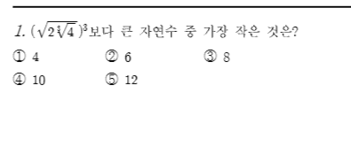
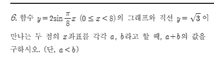
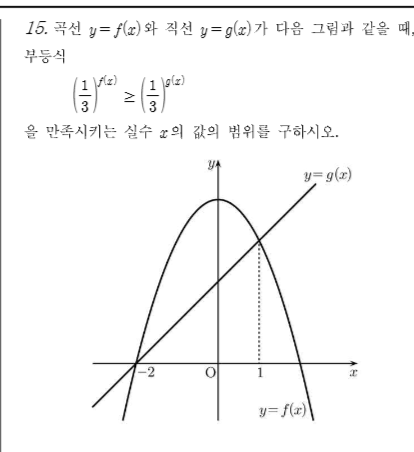
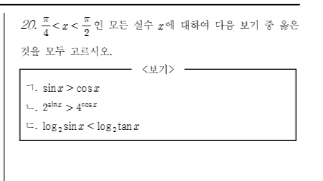

[문항 1]
[문제]

[빠른 정답] 3

[해설]
문제 식은 $\left(\sqrt{2\sqrt[3]{4}}\right)^{3}$이다. 이를 전개하면 다음과 같다  
$$\left(\sqrt{2\sqrt[3]{4}}\right)^{3} = \left(2\sqrt[3]{4}\right)^{\frac{3}{2}} = 2^{\frac{3}{2}} \cdot \left(\sqrt[3]{4}\right)^{\frac{3}{2}} = 2^{\frac{3}{2}} \cdot 4^{\frac{1}{2}} = 2^{\frac{3}{2}} \cdot 2^{1} = 2^{\frac{3}{2}+1} = 2^{\frac{5}{2}} = \sqrt{32} = 4\sqrt{2} \approx 5.656$$  
따라서 $4\sqrt{2}$보다 큰 자연수 중 가장 작은 수는 6, 8, 10, 12 중에서 6이다.  
결론적으로, 정답은 3번이다.

[문항 2]
[문제]

[빠른 정답] 2

[해설]
$5 \sin \theta + 12 = 12 \tan \theta$를 변형한다. $\tan \theta = \frac{\sin \theta}{\cos \theta}$를 대입하면,
$$5 \sin \theta + 12 = 12 \frac{\sin \theta}{\cos \theta}$$

양변에 $\cos \theta$를 곱하면,

$$5 \sin \theta \cos \theta + 12 \cos \theta = 12 \sin \theta$$

정리하면,

$$5 \sin \theta \cos \theta - 12 \sin \theta + 12 \cos \theta = 0$$

이를 $\sin \theta$에 대해 정리하면,

$$\sin \theta (5 \cos \theta - 12) + 12 \cos \theta = 0$$

따라서,

$$\sin \theta (5 \cos \theta - 12) = -12 \cos \theta$$

이제 $\sin^2 \theta + \cos^2 \theta = 1$을 이용하여 $\sin \theta$와 $\cos \theta$의 관계를 찾는다. $\sin \theta = \frac{12 \cos \theta}{12 - 5 \cos \theta}$를 대입하여 정리하면,

$$\left(\frac{12 \cos \theta}{12 - 5 \cos \theta}\right)^2 + \cos^2 \theta = 1$$

이 식을 풀어 $\cos \theta$의 값을 구한 후, $\sin \theta$를 구하고 $\sin \theta - \cos \theta$를 계산하면 최종적으로 $\sin \theta - \cos \theta = -\frac{1}{5}$가 된다. 따라서 정답은 2번이다.

[문항 3]
[문제]

[빠른 정답] 2

[해설]
주어진 식은 $\log_{2} a \times \log_{b} 16 = 1$이다.
먼저 $\log_{b} 16$을 $\log_{b} 2^4$로 바꾸면, $\log_{b} 16 = 4 \log_{b} 2$이다. 따라서 식은 다음과 같이 변형된다:

$$\log_{2} a \times 4 \log_{b} 2 = 1$$

양변을 4로 나누면:

$$\log_{2} a \times \log_{b} 2 = \frac{1}{4}$$

이제 $\log_{b} 2$를 $x$라고 두면, $\log_{2} a = \frac{1}{4x}$가 된다. 

이제 $\log_{a} b + \log_{b} a$를 구해보자 

$$\log_{a} b = \frac{1}{\log_{b} a} = \frac{1}{\frac{1}{\log_{b} 2} \cdot \log_{2} a} = \frac{\log_{b} 2}{\log_{2} a}$$

따라서,

$$\log_{a} b + \log_{b} a = \frac{\log_{b} 2}{\log_{2} a} + \log_{b} a$$

여기서 $\log_{b} a = \frac{1}{\log_{a} b}$이므로,

$$\log_{a} b + \log_{b} a = \frac{\log_{b} 2}{\frac{1}{4x}} + x = 4x + x = 5x$$

이제 $x = \log_{b} 2$를 구해야 한다. 

원래 식에서 $\log_{2} a \times \log_{b} 2 = \frac{1}{4}$이므로, $x = \frac{1}{5}$가 된다. 

따라서,

$$\log_{a} b + \log_{b} a = 5 \cdot \frac{1}{5} = 2$$

결론적으로 $\log_{a} b + \log_{b} a$의 값은 2이다.

[문항 4]
[문제]

[빠른 정답] 8

[해설]
주어진 함수는 $y=2\sin\frac{\pi}{8}x$이고, $0 \leq x < 8$의 범위에서 직선 $y=\sqrt{3}$과 만나는 두 점의 $x$ 좌표를 $a, b$라고 할 때 $a+b$의 값을 구하는 문제입니다.

먼저 함수 $y=2\sin\frac{\pi}{8}x$와 직선 $y=\sqrt{3}$이 만나는 점의 $x$ 좌표를 구하기 위해 방정식을 세웁니다.
$2\sin\frac{\pi}{8}x = \sqrt{3}$
$\sin\frac{\pi}{8}x = \frac{\sqrt{3}}{2}$

사인 함수의 값이 $\frac{\sqrt{3}}{2}$이 되는 경우는 $\frac{\pi}{3}$ 또는 $\frac{2\pi}{3}$ 등입니다.
따라서, $\frac{\pi}{8}x$에 해당하는 일반적인 해는 다음과 같습니다.
$\frac{\pi}{8}x = \frac{\pi}{3} + 2n\pi$ 또는 $\frac{\pi}{8}x = \frac{2\pi}{3} + 2n\pi$ (단, $n$은 정수)

각 경우에 대해 $x$에 대해 정리하면 다음과 같습니다.
$x = \frac{8}{3} + 16n$ 또는 $x = \frac{16}{3} + 16n$

문제에서 주어진 범위는 $0 \leq x < 8$입니다. 이 범위에 해당하는 해를 찾아야 합니다.

첫 번째 경우: $x = \frac{8}{3} + 16n$
$n=0$일 때, $x = \frac{8}{3}$
이 값은 $0 \leq \frac{8}{3} < 8$을 만족합니다.

두 번째 경우: $x = \frac{16}{3} + 16n$
$n=0$일 때, $x = \frac{16}{3}$
이 값은 $0 \leq \frac{16}{3} < 8$을 만족합니다.

따라서, 주어진 범위에서 두 점의 $x$ 좌표는 $\frac{8}{3}$과 $\frac{16}{3}$입니다.
문제에서 $a<b$라고 했으므로, $a = \frac{8}{3}$이고 $b = \frac{16}{3}$입니다.

구하고자 하는 $a+b$의 값은 다음과 같습니다.
$a+b = \frac{8}{3} + \frac{16}{3} = \frac{24}{3} = 8$

다른 방법으로, 사인 함수의 그래프의 대칭성을 이용할 수 있습니다.
함수 $y = \sin \theta$는 $\theta = \frac{\pi}{2}$에 대해 대칭입니다.
여기서 $\theta = \frac{\pi}{8}x$이므로, $\frac{\pi}{8}x = \frac{\pi}{2}$일 때 즉, $x=4$일 때 그래프는 대칭축을 가집니다.
$\sin\frac{\pi}{8}x = \frac{\sqrt{3}}{2}$를 만족하는 첫 번째 해를 $a$라고 하면, $a$는 $0 < a < 4$ 범위에 있습니다.
사인 함수의 대칭성에 의해, $a$와 $b$는 $x=4$에 대해 대칭이므로, $\frac{a+b}{2} = 4$가 성립합니다.
따라서, $a+b = 8$입니다.

[문항 5]
[문제]

[빠른 정답] $x \leq -2$ 또는 $x \geq 1$

[해설]
주어진 부등식은 $\left(\frac{1}{3}\right)^{f(x)} \geq\left(\frac{1}{3}\right)^{g(x)}$ 이다.
밑이 $\frac{1}{3}$으로 $0 < \frac{1}{3} < 1$ 이므로, 지수함수의 성질에 의해 부등호의 방향이 반대로 바뀐다.
따라서 $f(x) \leq g(x)$ 를 만족하는 $x$의 값의 범위를 구하면 된다.

주어진 그래프에서 곡선 $y=f(x)$ 와 직선 $y=g(x)$ 의 교점의 $x$좌표를 확인한다.
그래프에서 두 함수가 만나는 점은 $x=-2$ 와 $x=1$ 이다.
부등식 $f(x) \leq g(x)$ 는 그래프에서 곡선 $y=f(x)$ 가 직선 $y=g(x)$ 보다 아래쪽에 있거나 같은 부분을 의미한다.
그래프를 보면, $x \leq -2$ 일 때 곡선 $y=f(x)$ 가 직선 $y=g(x)$ 보다 아래쪽에 있거나 같고, $x \geq 1$ 일 때도 곡선 $y=f(x)$ 가 직선 $y=g(x)$ 보다 아래쪽에 있거나 같다.
따라서 부등식을 만족시키는 실수 $x$의 값의 범위는 $x \leq -2$ 또는 $x \geq 1$ 이다.

[문항 6]
[문제]

[빠른 정답] 1

[해설]
$\frac{\pi}{4}<x<\frac{\pi}{2}$ 인 모든 실수 $x$ 에 대하여 다음을 검토한다.
ㄱ. $\sin x > \cos x$

이 구간에서 $\sin x$는 증가하고 $\cos x$는 감소하므로, $\sin x$는 $\cos x$보다 항상 크다. 따라서 이 식은 참이다.

ㄴ. $2^{\sin x} > 4^{\cos x}$

$4^{\cos x} = (2^2)^{\cos x} = 2^{2\cos x}$ 이므로, 식은 $2^{\sin x} > 2^{2\cos x}$로 변형된다. 이는 $\sin x > 2\cos x$와 동치이다. 이 구간에서 $\sin x$는 최대 $\sqrt{2}/2$에 도달하고, $2\cos x$는 최대 $2$에 도달하므로, 이 식은 참이 아니다.

ㄷ. $\log_2 \sin x < \log_2 \tan x$

$\tan x = \frac{\sin x}{\cos x}$이므로, $\log_2 \tan x = \log_2 \sin x - \log_2 \cos x$이다. 따라서 $\log_2 \sin x < \log_2 \sin x - \log_2 \cos x$가 성립하려면 $\log_2 \cos x < 0$이어야 한다. $\cos x$는 이 구간에서 양수이므로, 이 식은 참이다.

결론적으로, 옳은 것은 ㄱ과 ㄷ이다.

[문항 7]
[문제]

[빠른 정답] 6

[해설]
반지름의 길이가 1인 반원의 호 AB를 12등분하므로, 각 점 $\mathrm{P}_k$ (단, $k=1, 2, \ldots, 11$)와 원점 O를 잇는 선분 $\mathrm{OP}_k$는 선분 AB와 이루는 각의 크기는 다음과 같다.
$\angle \mathrm{AOP}_k = \frac{\pi}{12} k$
점 $\mathrm{P}_k$에서 선분 AB에 내린 수선의 발을 $\mathrm{Q}_k$라고 할 때, $\triangle \mathrm{OP}_k\mathrm{Q}_k$는 직각삼각형이다.
이때, $\overline{\mathrm{P}_k\mathrm{Q}_k}$는 $\triangle \mathrm{OP}_k\mathrm{Q}_k$에서 $\angle \mathrm{POQ}_k$에 대한 대변의 길이가 된다.
$\overline{\mathrm{P}_k\mathrm{Q}_k} = \overline{\mathrm{OP}_k} \sin(\angle \mathrm{POQ}_k)$
반지름의 길이가 1이므로 $\overline{\mathrm{OP}_k} = 1$이다.
따라서, $\overline{\mathrm{P}_k\mathrm{Q}_k} = 1 \cdot \sin\left(\frac{\pi k}{12}\right) = \sin\left(\frac{\pi k}{12}\right)$
구하고자 하는 값은 $\sum_{k=1}^{11} \overline{\mathrm{P}_k\mathrm{Q}_k}^2$ 이므로,
$\sum_{k=1}^{11} \sin^2\left(\frac{\pi k}{12}\right)$
이다.
삼각함수의 성질에 의해 $\sin^2 x + \cos^2 x = 1$ 이고, $\sin(\pi - x) = \sin x$ 이므로,
$\sin^2\left(\frac{\pi k}{12}\right) = \sin^2\left(\pi - \frac{\pi k}{12}\right) = \sin^2\left(\frac{\pi(12-k)}{12}\right)$
이다.
따라서,
$\sin^2\left(\frac{\pi}{12}\right) = \sin^2\left(\frac{11\pi}{12}\right)$
$\sin^2\left(\frac{2\pi}{12}\right) = \sin^2\left(\frac{10\pi}{12}\right)$
$\sin^2\left(\frac{3\pi}{12}\right) = \sin^2\left(\frac{9\pi}{12}\right)$
$\sin^2\left(\frac{4\pi}{12}\right) = \sin^2\left(\frac{8\pi}{12}\right)$
$\sin^2\left(\frac{5\pi}{12}\right) = \sin^2\left(\frac{7\pi}{12}\right)$
이다.
또한, $\sin^2\left(\frac{6\pi}{12}\right) = \sin^2\left(\frac{\pi}{2}\right) = 1^2 = 1$ 이다.
구하는 합은 다음과 같이 계산된다.
$\sum_{k=1}^{11} \sin^2\left(\frac{\pi k}{12}\right) = \sin^2\left(\frac{\pi}{12}\right) + \sin^2\left(\frac{2\pi}{12}\right) + \ldots + \sin^2\left(\frac{5\pi}{12}\right) + \sin^2\left(\frac{6\pi}{12}\right) + \sin^2\left(\frac{7\pi}{12}\right) + \ldots + \sin^2\left(\frac{11\pi}{12}\right)$
$= 2 \left( \sin^2\left(\frac{\pi}{12}\right) + \sin^2\left(\frac{2\pi}{12}\right) + \sin^2\left(\frac{3\pi}{12}\right) + \sin^2\left(\frac{4\pi}{12}\right) + \sin^2\left(\frac{5\pi}{12}\right) \right) + \sin^2\left(\frac{6\pi}{12}\right)$
$\sin^2\left(\frac{\pi}{12}\right) + \sin^2\left(\frac{5\pi}{12}\right) = \sin^2\left(\frac{\pi}{12}\right) + \cos^2\left(\frac{\pi}{2} - \frac{5\pi}{12}\right) = \sin^2\left(\frac{\pi}{12}\right) + \cos^2\left(\frac{\pi}{12}\right) = 1$
마찬가지로,
$\sin^2\left(\frac{2\pi}{12}\right) + \sin^2\left(\frac{4\pi}{12}\right) = 1$
$\sin^2\left(\frac{3\pi}{12}\right) = \sin^2\left(\frac{\pi}{4}\right) = \left(\frac{\sqrt{2}}{2}\right)^2 = \frac{1}{2}$
$\sin^2\left(\frac{6\pi}{12}\right) = \sin^2\left(\frac{\pi}{2}\right) = 1$
따라서,
$2 \left( 1 + 1 + \frac{1}{2} \right) + 1 = 2 \left( \frac{5}{2} \right) + 1 = 5 + 1 = 6$
