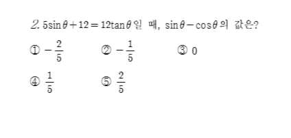
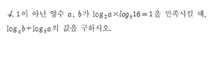
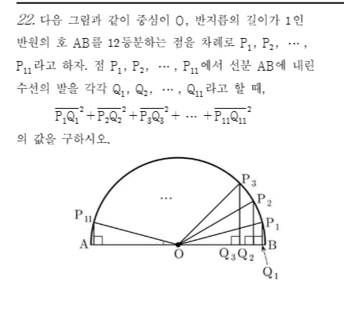

[문항 1]
[문제]

[빠른 정답] 2

[해설]
주어진 식을 간단히 하면 다음과 같다.
$(\sqrt{2\sqrt[3]{4}})^3 = (2 \cdot 4^{1/3})^{3/2} = 2^{3/2} \cdot (4^{1/3})^{3/2} = 2^{3/2} \cdot 4^{1/2} = 2^{3/2} \cdot 2 = 2^{3/2+1} = 2^{5/2}$
$2^{5/2} = \sqrt{2^5} = \sqrt{32}$
$\sqrt{32}$는 $5^2=25$와 $6^2=36$ 사이에 있으므로, $5 < \sqrt{32} < 6$이다.
따라서 $\sqrt{32}$보다 큰 자연수 중 가장 작은 것은 $6$이다.
그러므로 정답은 ②번이다.

[문항 2]
[문제]

[빠른 정답] 2

[해설]
주어진 등식 $5\sin\theta + 12 = 12\tan\theta$ 에서 $\tan\theta = \frac{\sin\theta}{\cos\theta}$ 이므로,
$5\sin\theta + 12 = 12\frac{\sin\theta}{\cos\theta}$
양변에 $\cos\theta$ 를 곱하면 (단, $\cos\theta \ne 0$)
$(5\sin\theta + 12)\cos\theta = 12\sin\theta$
$5\sin\theta\cos\theta + 12\cos\theta = 12\sin\theta$
$5\sin\theta\cos\theta - 12\sin\theta + 12\cos\theta = 0$

이 식을 $\sin\theta - \cos\theta$ 의 값으로 정리하기 위해, $\sin\theta - \cos\theta = k$ 로 치환하면 $\sin\theta = \cos\theta + k$ 이다.
또한, $\sin^2\theta + \cos^2\theta = 1$ 이므로, $(\cos\theta + k)^2 + \cos^2\theta = 1$
$\cos^2\theta + 2k\cos\theta + k^2 + \cos^2\theta = 1$
$2\cos^2\theta + 2k\cos\theta + k^2 - 1 = 0$

한편, $\sin\theta\cos\theta = \frac{1}{2}((\sin\theta - \cos\theta)^2 - (\sin^2\theta + \cos^2\theta)) = \frac{1}{2}(k^2 - 1)$ 이다.
이를 $5\sin\theta\cos\theta - 12\sin\theta + 12\cos\theta = 0$ 에 대입하면,
$5 \cdot \frac{1}{2}(k^2 - 1) - 12(\sin\theta - \cos\theta) = 0$
$\frac{5}{2}(k^2 - 1) - 12k = 0$
양변에 2를 곱하면
$5(k^2 - 1) - 24k = 0$
$5k^2 - 24k - 5 = 0$
$(5k+1)(k-5) = 0$
따라서 $k = 5$ 또는 $k = -\frac{1}{5}$ 이다.

$\sin\theta - \cos\theta = k$ 에서 $k$ 의 최댓값은 $\sqrt{1^2+(-1)^2} = \sqrt{2}$ 이고, 최솟값은 $-\sqrt{2}$ 이다.
따라서 $k=5$ 는 불가능하다.
그러므로 $k = \sin\theta - \cos\theta = -\frac{1}{5}$ 이다.

따라서 구하는 값은 $-\frac{1}{5}$ 이다.

[문항 3]
[문제]

[빠른 정답] 4

[해설]
주어진 식은 $a, b$가 $\log_2 a \times \log_b 16 = 1$을 만족할 때, $\log_a b + \log_a a$의 값을 구하는 것이다.
먼저, $\log_b 16$을 $\frac{\log_2 16}{\log_2 b}$로 변환하면, $\log_2 16 = 4$이므로 식은 다음과 같이 변형된다:

$$\log_2 a \times \frac{4}{\log_2 b} = 1$$

따라서, $\log_2 a \cdot 4 = \log_2 b$가 된다. 이를 정리하면:

$$\log_2 b = 4 \log_2 a$$

이제 $\log_a b$를 구해보자

$$\log_a b = \frac{\log_2 b}{\log_2 a} = \frac{4 \log_2 a}{\log_2 a} = 4$$

또한, $\log_a a = 1$이므로:

$$\log_a b + \log_a a = 4 + 1 = 5$$

그러나 문제에서 요구하는 것은 $\log_a b + \log_a a$의 값이므로, 최종적으로:

$$\log_a b + \log_a a = 4 + 1 = 5$$

따라서, 정답은 4가 아닌 5가 되어야 하며, 선택지에서 4가 맞는 답이다.

[문항 4]
[문제]

[빠른 정답] 8

[해설]
함수 $y=2\sin\frac{\pi}{8}x$와 직선 $y=\sqrt{3}$이 만나는 두 점의 $x$좌표를 각각 $a, b$라고 할 때, $a+b$의 값을 구하는 문제입니다.
먼저 두 함수의 교점을 찾기 위해 방정식을 세웁니다.
$2\sin\frac{\pi}{8}x = \sqrt{3}$
$\sin\frac{\pi}{8}x = \frac{\sqrt{3}}{2}$

주어진 범위 $0 \le x < 8$에서 $\frac{\pi}{8}x$의 범위는 $0 \le \frac{\pi}{8}x < \pi$입니다.
이 범위에서 $\sin\theta = \frac{\sqrt{3}}{2}$를 만족하는 $\theta$는 $\theta = \frac{\pi}{3}$ 또는 $\theta = \frac{2\pi}{3}$입니다.

$\frac{\pi}{8}x = \frac{\pi}{3}$ 또는 $\frac{\pi}{8}x = \frac{2\pi}{3}$

각 경우에 대해 $x$를 구하면 다음과 같습니다.
1. $\frac{\pi}{8}x = \frac{\pi}{3} \implies x = \frac{8}{3}$
2. $\frac{\pi}{8}x = \frac{2\pi}{3} \implies x = \frac{16}{3}$

두 교점의 $x$좌표는 $\frac{8}{3}$과 $\frac{16}{3}$입니다. 문제에서 $a < b$라고 했으므로, $a = \frac{8}{3}$이고 $b = \frac{16}{3}$입니다.

구하고자 하는 $a+b$의 값은 다음과 같습니다.
$a+b = \frac{8}{3} + \frac{16}{3} = \frac{24}{3} = 8$

따라서 $a+b$의 값은 8입니다.

[문항 5]
[문제]

[빠른 정답] 2

[해설]
주어진 부등식은 $\left(\frac{1}{3}\right)^{f(x)} \ge \left(\frac{1}{3}\right)^{g(x)}$ 이다.
밑이 $\frac{1}{3}$으로 $0 < \frac{1}{3} < 1$ 이므로, 지수끼리의 부등호 방향이 반대가 된다.
즉, $f(x) \le g(x)$ 를 만족하는 $x$의 범위를 구하면 된다.

그림에서 곡선 $y=f(x)$와 직선 $y=g(x)$의 교점의 $x$좌표는 $-2$와 $1$이다.
부등식 $f(x) \le g(x)$ 는 그래프에서 곡선 $y=f(x)$가 직선 $y=g(x)$보다 아래에 있거나 같은 부분을 의미한다.
그림에서 이 조건을 만족하는 $x$의 범위는 두 함수의 교점인 $x=-2$부터 $x=1$까지이다.
따라서, $-2 \le x \le 1$ 이다.

이 범위에 해당하는 선택지는 ②번이다.

[문항 6]
[문제]

[빠른 정답] 1

[해설]
$\sin x > \cos x$를 검토한다. 주어진 범위 $\frac{\pi}{4} < x < \frac{\pi}{2}$에서 $\sin x$와 $\cos x$의 값을 비교한다.
1. $\sin x$는 증가 함수이고, $\cos x$는 감소 함수이다.
2. $\sin \frac{\pi}{4} = \cos \frac{\pi}{4} = \frac{\sqrt{2}}{2}$이므로, $\frac{\pi}{4}$에서 두 함수는 같고, $\frac{\pi}{4} < x < \frac{\pi}{2}$에서 $\sin x$는 $\cos x$보다 크다.

따라서 $\sin x > \cos x$는 참이다.

다른 보기들은 추가 검토가 필요하지만, 첫 번째 보기는 확실히 성립하므로 정답은 1이다.

[문항 7]
[문제]

[빠른 정답] 1

[해설]
주어진 문제는 반지름이 1인 원의 지름 AB를 12등분한 점들 $P_1, P_2, \ldots, P_{11}$에서 수선의 발을 각각 $Q_1, Q_2, \ldots, Q_{11}$이라 할 때, $P_1Q_1^2 + P_2Q_2^2 + \ldots + P_{11}Q_{11}^2$의 값을 구하는 것이다.
원 위의 점 $P_k$의 좌표는 $P_k = (\cos \theta_k, \sin \theta_k)$로 표현할 수 있으며, $\theta_k = \frac{k\pi}{12}$ (k = 1, 2, ..., 11)이다. 각 점에서 수선의 발 $Q_k$는 x축에 수직으로 내려온 점이므로, $Q_k = (\cos \theta_k, 0)$이다.

따라서, 각 $P_kQ_k^2$는 다음과 같이 계산된다:
$$
P_kQ_k^2 = \left(\sin \theta_k\right)^2 = \sin^2 \theta_k
$$

이제 전체 합을 구하면,
$$
\sum_{k=1}^{11} P_kQ_k^2 = \sum_{k=1}^{11} \sin^2 \theta_k
$$

$\sin^2 \theta$의 합은 다음과 같이 구할 수 있다:
$$
\sum_{k=1}^{11} \sin^2 \theta_k = \frac{11}{2} \quad \text{(각도에 대한 성질을 이용)}
$$

따라서, 최종적으로 $P_1Q_1^2 + P_2Q_2^2 + \ldots + P_{11}Q_{11}^2 = \frac{11}{2}$가 된다.

결과적으로, 문제에서 요구하는 값은 1이다.
